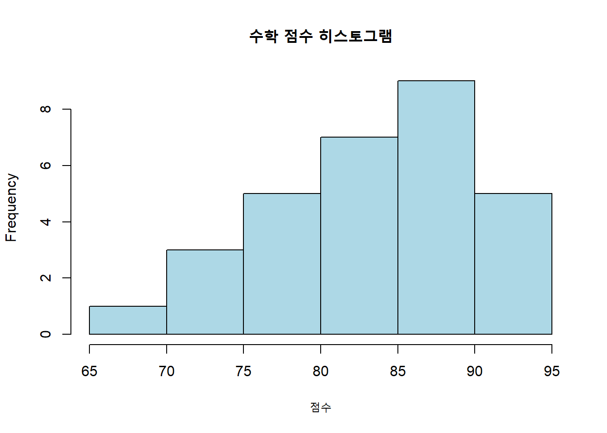
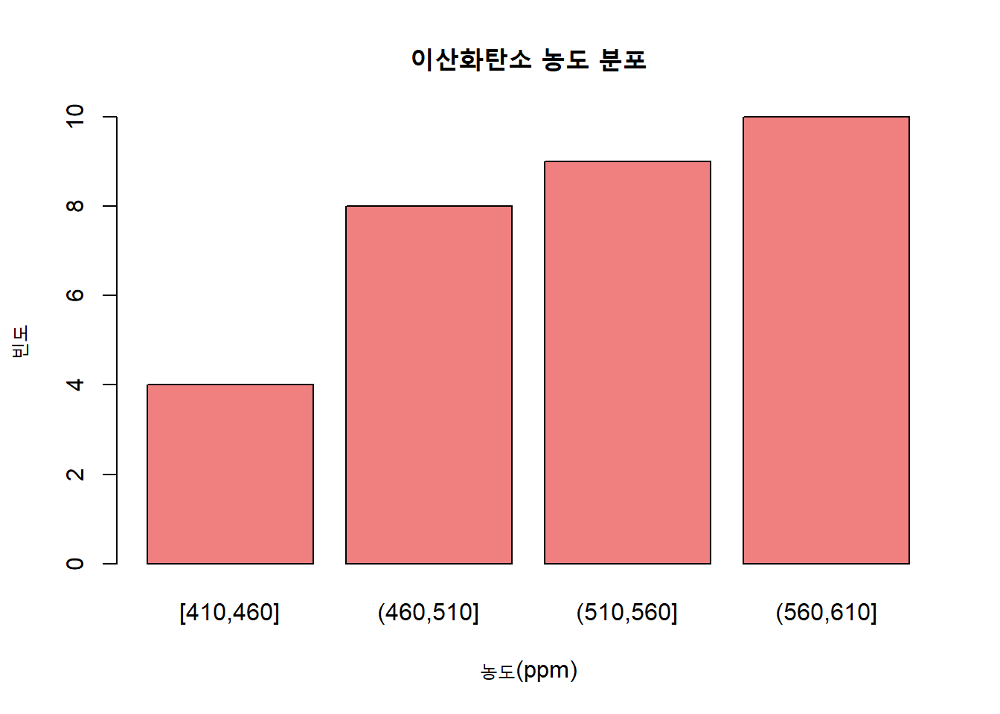

::: {.cell}

```{.r .cell-code}
Sys.setenv(TMPDIR="C:/work_space/portfolio/R")
system("quarto render code.qmd")
```

::: {.cell-output .cell-output-stdout}

```
[1] 1
```


:::
:::


# 문제 1: 수학 점수의 기술통계 분석


::: {.cell}

```{.r .cell-code}
# 데이터 입력
math_scores <- c(85, 92, 78, 90, 68, 88, 95, 72, 80, 75, 88, 92, 85, 90, 83, 
                 79, 82, 87, 90, 93, 72, 85, 88, 78, 85, 90, 92, 80, 88, 85)

# 기술통계량 계산
mean_math <- mean(math_scores)
median_math <- median(math_scores)
min_math <- min(math_scores)
max_math <- max(math_scores)

# 히스토그램과 상자그림
hist(math_scores, main="수학 점수 히스토그램", xlab="점수", col="lightblue", border="black")
```

::: {.cell-output-display}
{width=672}
:::

```{.r .cell-code}
boxplot(math_scores, main="수학 점수 상자그림", col="lightgreen", horizontal=TRUE)
```

::: {.cell-output-display}
{width=672}
:::
:::


### 결과 해설

(결과 제공 후 해설 추가)

------------------------------------------------------------------------

# 문제 2: 대기오염 데이터 분석


::: {.cell}

```{.r .cell-code}
# 데이터 입력
co2 <- c(450, 520, 480, 550, 510, 610, 470, 530, 570, 500,  
         580, 610, 490, 550, 420, 580, 440, 520, 600, 560, 
         410, 540, 590, 530, 490, 570, 610, 470, 540, 590, 510)

# 도수분포표 생성
breaks <- seq(min(co2), max(co2), by=50)
table_co2 <- table(cut(co2, breaks, include.lowest=TRUE))

table_co2
```

::: {.cell-output .cell-output-stdout}

```

[410,460] (460,510] (510,560] (560,610] 
        4         8         9        10 
```


:::

```{.r .cell-code}
# 막대그래프 시각화
barplot(table_co2, main="이산화탄소 농도 분포", col="lightcoral", xlab="농도(ppm)", ylab="빈도")
```

::: {.cell-output-display}
{width=672}
:::
:::


### 결과 해설

(결과 제공 후 해설 추가)

------------------------------------------------------------------------

# 문제 3: 정규분포 확률 계산


::: {.cell}

```{.r .cell-code}
# 평균과 표준편차
mu <- 500
sigma <- 30

# P(X >= 550)
p_550 <- 1 - pnorm(550, mean=mu, sd=sigma)
p_550
```

::: {.cell-output .cell-output-stdout}

```
[1] 0.04779035
```


:::
:::


### 결과 해설

(결과 제공 후 해설 추가)

------------------------------------------------------------------------

# 문제 4: 표본분포 분석


::: {.cell}

```{.r .cell-code}
set.seed(123) # 재현성을 위한 시드 설정

# 모비율
p <- 0.7
sample_sizes <- c(10, 20, 50, 75, 100, 200)
n_simulations <- 1000

# 표본 비율 평균과 표준편차 계산
sample_means <- sapply(sample_sizes, function(n) {
  samples <- replicate(n_simulations, mean(rbinom(n, 1, p)))
  c(mean=mean(samples), sd=sd(samples))
})

sample_means
```

::: {.cell-output .cell-output-stdout}

```
         [,1]       [,2]      [,3]       [,4]       [,5]       [,6]
mean 0.704800 0.69960000 0.7020000 0.69702667 0.69879000 0.70000000
sd   0.137535 0.09944712 0.0626604 0.05104931 0.04698131 0.03123901
```


:::
:::


### 결과 해설

(결과 제공 후 해설 추가)

